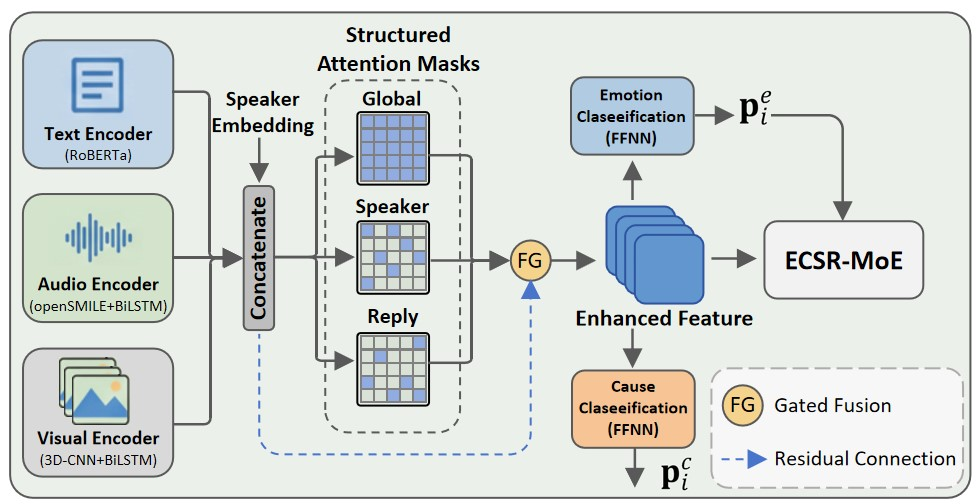
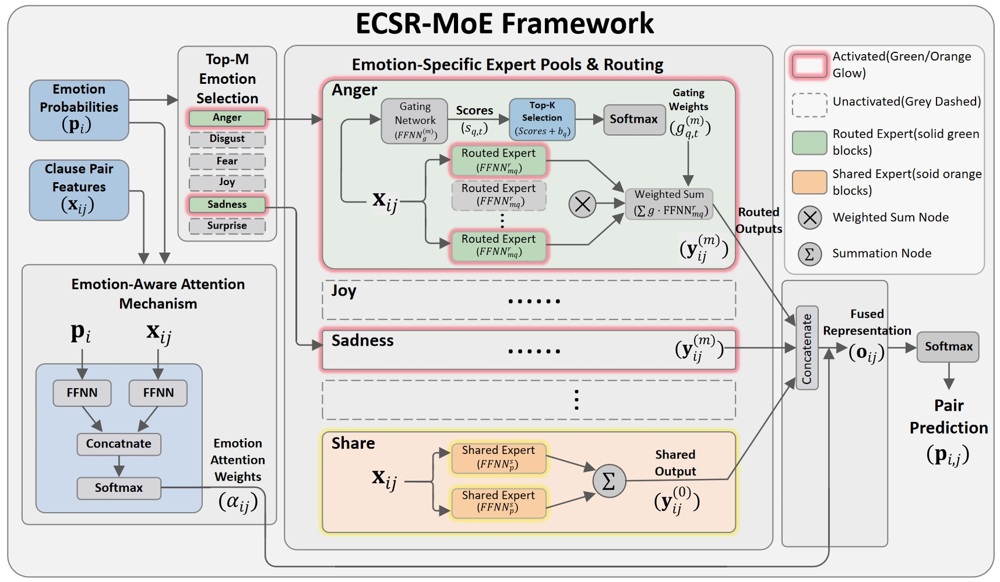

# Emotion-Conditional Sparse Routed Mixture-of-Experts for Multimodal Emotion-Cause Pair Extraction
## Overview ##
<p align="center">
<table style="width:100%; border:none;">
  <tr>
    <td align="center" style="width:50%;">
      
    </td>
    <td align="center" style="width:50%;">
      
    </td>
  </tr>
</table>
</p>
**This project contains the code for the paper **Emotion-Conditional Sparse Routed Mixture-of-Experts for Multimodal Emotion-Cause Pair Extraction**.


## Dependencies

This project is based on PyTorch and Transformers. 
You can create the conda environment using the following command:

```bash
conda create -n ECSR python=3.8 -y
conda activate ECSR
pip install -r requirements.txt 
```

## Configuration

The configurations for the model and training process are stored in `src/config.yaml`. You can modify this file to adjust the settings.

## Data
The dataset is located in data/dataset. Please follow the instructions in [data/dataset/README.md](data/dataset/README.md) to download the audio and video features, and place them in the data/dataset directory.
## Directory structure
<pre>
```
ECSR-MoE/
├── data
│   ├── dataset
│   │   ├── all_data_pair.txt
│   │   ├── audio_embedding_6373.npy
│   │   ├── README.md
│   │   ├── test.txt
│   │   ├── train.txt
│   │   ├── valid.txt
│   │   ├── video_embedding_4096.npy
│   │   └── video_id_mapping.npy
│   ├── preprocessed
│   │   └── roberta-base.pkl
│   └── save
│       └── best_model
├── evaluate.py
├── main.py
├── src
│   ├── config.yaml
│   ├── layer.py
│   ├── loader.py
│   ├── model.py
│   ├── tools.py
│   └── trainer.py
└── environment.yml
```
</pre>
## Usage
You can run the following command to train `&` evaluate the model:  
`python main.py`
### Reproduction / Evaluation
The model weights have been uploaded to Hugging Face (single `.pt` file).
Manual download link:  [https://huggingface.co/zzhfellow/ecsr-moe-pt]
After downloading, please update the `'pretrained_model_path'` in the `evaluate.py` script to point to the downloaded model file.

### Run
```bash
python evaluate.py
